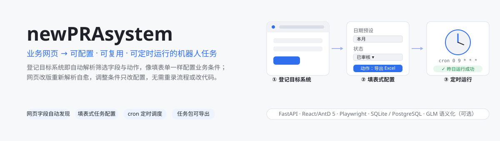

<p align="center">
  
</p>

**一个将企业业务网页自动转化为可配置、可复用、可定时运行的机器人任务的平台。**

业务人员在平台登记目标系统后，平台自动解析网页中的筛选字段与可执行动作，生成可视化任务配置界面；用户像填表单一样配置业务条件，即可创建长期定时运行的自动化任务——**调整业务条件只需改配置，无需重录流程或改代码**。

## 为什么不用录屏 / 传统 RPA

录屏类自动化把操作步骤固化成脚本：网页一改版脚本就失效，改一个查询条件也要整段重录。newPRAsystem 把「执行能力」与「业务意图」分开存：系统解析网页得到字段与动作（能力），任务只保存业务条件（意图）。执行时按语义现场匹配定位元素，网页改版后**更新页面档案**即可自愈，老任务不受影响；条件变化只改配置。

## 快速开始

前置要求：**Node.js 18+**、**Python 3.11+**（已加入 PATH），Windows。

> **关于数据库**：仓库不包含 PostgreSQL 便携版（`pg17/` 约 960MB，不入库）。部署脚本会自动检测——没有它就以 **SQLite** 模式运行，零数据库配置、开箱即用；需要 PostgreSQL 再按方式 B 接入，两种模式表结构兼容、数据可迁移。

### 方式 A · SQLite，零数据库配置（建议先用这条跑通）

```text
1. 双击 setup.bat   安装前后端依赖 + 下载 Playwright Chromium
                    检测到无 pg17\ 时自动生成 server\.env（DATABASE_URL=sqlite:///./newpra.db），跳过数据库安装
2. 双击 start.bat   启动全部服务（首次启动自动建表、自动生成凭证加密密钥）
```

### 方式 B · PostgreSQL 完整体验

自选一种安装方式，两种都由 `setup.bat` 自动完成初始化与建库：

- **已有 PostgreSQL**：在 `server/.env` 配置 `DATABASE_URL=postgresql+psycopg2://<用户>:<密码>@<主机>:<端口>/<库名>`
- **便携版**：下载 EDB PostgreSQL 17 zip 解压为 `pg17\`（使 `pg17\bin\initdb.exe` 存在），`setup.bat` 将完成 initdb、建库 `newpra`（端口 5433）并启动

### 日常启动 / 停止

| 脚本 | 作用 |
|---|---|
| `start.bat` | 一键启动四个服务（已在运行的自动跳过） |
| `stop.bat`  | 一键停止全部服务 |

### 服务地址

| 服务 | 地址 | 说明 |
|---|---|---|
| **平台前端** | http://localhost:5174 | 主入口 |
| 模拟业务系统 | http://localhost:5173 | 登录 admin / admin123，用于体验全流程 |
| 后端 API | http://localhost:8000/api/health | 健康检查 |
| PostgreSQL | localhost:5433 / 库 `newpra` | 仅方式 B；方式 A 为 SQLite（`server/newpra.db`） |

## 三分钟上手（用模拟系统走通全流程）

1. **目标系统** → 新建系统：登录页 URL 填 `http://localhost:5173/login`，账号 `admin` / 密码 `admin123`
2. **接入向导** → 选系统、目标 URL 填 `http://localhost:5173/report` → 开始解析 → 确认字段
3. **任务管理** → 新建任务 → 像填表单一样选条件（日期预设 / 区域多选 / 状态）→ 选动作「导出 Excel」→ 勾选前置动作「查询」→ 选运行频率 → 创建
4. 任务列表 → **立即运行** → 详情页看运行历史、下载导出的 CSV
5. 进阶体验：任务**编辑配置**（改条件直接重跑）、**创建副本**、**更新页面档案**（网页改版后重新解析纳入新字段）、**导出任务包**（生成自包含脚本，可交任意调度平台执行）

## 核心能力

| 能力 | 说明 |
|---|---|
| 网页字段自动发现 | 支持 Ant Design / Element UI / Element Plus / OrangeHRM(oxd) / 原生表单；下拉选项交互式抓取 |
| 自动生成配置面板 | 按档案字段类型动态渲染表单（日期预设 / 多选 / 下拉 / 文本） |
| 配置驱动回放 | 任务只存业务配置不固化 selector，执行时现场语义匹配定位，网页改版可自愈 |
| 档案更新 | 网页新增筛选项 → 重新解析 → diff 确认纳入，老任务不受影响（版本化） |
| 定时调度 | cron 表达式，预设 + 自定义；平台内托管执行 |
| 结果通知 | 邮件 / 飞书群机器人 webhook |
| 任务导出 | zip 任务包（自包含脚本 + 外部 `task_config.json`），脚本仅依赖 playwright；账号密码与输出目录在配置文件中调整，交任意调度平台运行无需改脚本 |
| 登录会话复用 | storage_state 按系统持久化，失效自动重登 |
| 凭证安全 | Fernet 对称加密存储，密钥首次启动自动生成（`server/.env`，请勿提交到版本库） |

## 目录结构

```
newPRAsystem/
├─ start.bat / stop.bat / setup.bat   # 一键启动 / 停止 / 部署（自动检测 SQLite / PostgreSQL 模式）
├─ demo-target/     # 模拟业务系统（React + AntD 5，含登录/报表/导出）
├─ server/          # 后端（FastAPI + SQLAlchemy + 解析/回放引擎 + 调度）
│   └─ .env.example # 环境变量模板（数据库 / GLM / SMTP，均为可选项）
├─ web/             # 平台前端（React + AntD 5）
├─ pg17/            # PostgreSQL 17 便携版（不入库；自行放置或已装 PG，见方式 B）
└─ docs/            # 文档
   ├─ HANDOVER.md       # 交接文档（架构 / 数据库 / API / 运维）
   └─ PROJECT_GUIDE.md  # 项目说明（产品 / 使用指南 / 能力边界）
```

## 可选增强（不配置自动降级，功能不受阻）

| 配置 | 作用 |
|---|---|
| `ZHIPUAI_API_KEY` | GLM 对网页字段做语义化命名（识别「统计月份」→ 日期范围控件），无 Key 降级为规则命名 |
| `SMTP_*` | 任务完成/失败邮件通知 |
| 飞书 webhook | 任务结果推送飞书群机器人 |

## 文档索引

- **交接文档**（[docs/HANDOVER.md](docs/HANDOVER.md)）：系统架构、数据库设计、核心机制实现、API 清单、运维手册、已知问题——**面向接手开发的工程师**
- **项目说明**（[docs/PROJECT_GUIDE.md](docs/PROJECT_GUIDE.md)）：产品定位、能力地图、操作指南、真实系统实测结论、里程碑——**面向使用与评估者**

## 技术栈

React 18 + Ant Design 5 / FastAPI + SQLAlchemy 2 + APScheduler / Playwright (Python) / SQLite（默认）→ PostgreSQL 17 / GLM API（可选，字段语义化）
